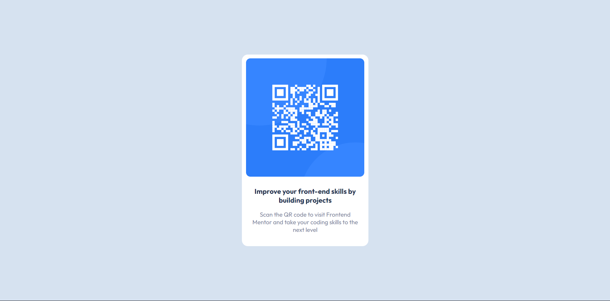

#  QR code component - Frontend Mentor 


Esta é uma solução para o [Desafio do componente de código QR no Frontend Mentor](https://www.frontendmentor.io/challenges/qr-code-component-iux_sIO_H). Os desafios do Frontend Mentor ajudam você a melhorar suas habilidades de codificação criando projetos realistas. 

## Table of contents

- [Visão Geral](#visão-geral)
  - [Screenshot](#screenshot)
  - [Links](#links)
- [Meu processo](#meu-processo)
  - [Como foi feito](#construído-com)
  - [ O que eu aprendi](#o-que-eu-aprendi)
  - [Evolução](#evolução)
  - [Recursos úteis](#recursos-úteis)
- [Autor](#autor)


## Visão geral

### Screenshot




### Links

- URL da solução: [Adicionar URL da solução aqui](https://your-solution-url.com)
- URL do site ao vivo: [Adicione URL do site ao vivo aqui](https://your-live-site-url.com)

## Meu processo

### Construído com

- HTML5 Semântico
- CSS3 
- Flexbox

### O que eu aprendi

Com esse projeto consegui melhorar a centralização de itens, bem como a estilização de imagens, textos e no uso de variaveis assim facilitando a edição do conteúdo;


```css
:root{
    --primary-color:hsl(212, 45%, 89%);
    --secondary-color:hsl(0, 0%, 100%);
    --text-color-medium:hsl(218, 44%, 22%);
    --text-color-low: hsl(220, 15%, 55%);
}
```

### Evolução

Desejo focar mais na área Flex e Grid do CSS para melhor estilização dos meus projetos, onde tenho certas dificuldades em centralizar os projetos;


### Recursos úteis

- [Resumo](https://angry-helicopter-3a6.notion.site/Resumos-DevQuest-d9c3dc80b08a4037a35ddb6d90355f0c) - Os meus resumos feitos com base no curso DEVQUEST me ajudaram bastante na criação desse projeto;

## Autor

- Github - [Willy-Braga](https://github.com/willy-braga)
- LinkedIn - [Willy Braga](https://www.linkedin.com/in/willy-braga-2861b3270/)
- Intragram - [@braga.wg](https://www.instagram.com/braga.wg/)

